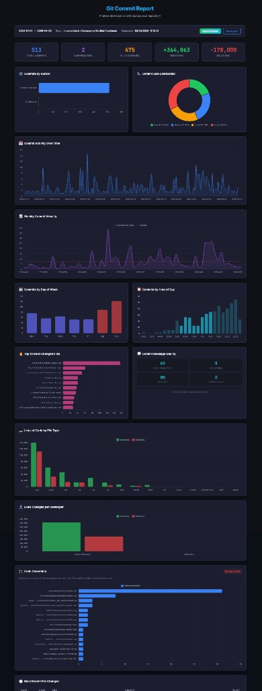

# Git Commit Report

A visual developer activity dashboard for any Git repository. Enter a repo path and date range, and instantly explore interactive charts covering commits, code ownership, velocity, productivity patterns, and more.




---

## Features

- **Interactive dashboard** — React + Chart.js frontend with a lightweight Express backend. Point it at any local repo and explore the data visually.
- **Flexible date ranges** — supports ISO dates (`2024-01-01`) and natural language (`30 days ago`).
- **Team filtering** — analyse specific team members or automatically discover all contributors.
- **Ticket tracking** — extract and count ticket references (JIRA, Linear, GitHub Issues, etc.) from commit messages.
- **Export to Excel** — download your report data as a spreadsheet for sharing with stakeholders.

### Dashboard Sections

| Section | Description |
|---|---|
| **Summary Cards** | Total commits, contributors, files changed, lines added/removed |
| **Commits by Author** | Horizontal bar chart per contributor |
| **Commit Size Distribution** | Pie chart of small, medium, and large commits |
| **Commit Activity Over Time** | Day-by-day activity line chart |
| **Weekly Commit Velocity** | Week-over-week trend of commit throughput |
| **Commits by Day of Week** | Bar chart showing which days are busiest |
| **Commits by Hour of Day** | Bar chart showing peak coding hours |
| **Top 10 Most Changed Files** | Most frequently touched files |
| **Commit Message Quality** | Breakdown of message length and formatting |
| **Lines of Code by File Type** | Breakdown by file extension |
| **Lines Changed per Developer** | Insertions vs deletions per author |
| **Code Ownership** | Proportional ownership across the codebase |
| **Most Recent File Changes** | Latest modified files with commit details |

---

## Quick Start

```bash
git clone https://github.com/presencewebdesign/git-history-report.git
cd git-history-report/app
npm install
npm run dev
```

Open [http://localhost:5173](http://localhost:5173), enter a repository path and date range, and click **Generate Report**.

### Prerequisites

- **Node.js 18+** and **npm**
- **Git** on your `PATH`
- **Bash 4.0+** (macOS or Linux) — the backend runs a shell script to collect Git data

---

## Running the Dashboard

### Development

```bash
cd app
npm install
npm run dev          # starts both frontend (port 5173) and backend (port 3001)
```

### Production Build

```bash
cd app
npm run build        # outputs to app/dist/
npm run preview      # preview the production build
```

> **Note:** The backend server must be running for the dashboard to function. It executes Git commands on the server against the repository path you provide. The dashboard is designed for **local use** — if you expose it on a network, be aware it runs Git commands against local file paths supplied by the user.

---

## Configuration

### Ticket Prefix

Enter your project's ticket prefix in the dashboard form when generating a report (e.g. `PROJ-`, `JIRA-`, `LINEAR-`). The dashboard will extract matching references from commit messages and display ticket-level breakdowns per developer.

---

## Project Structure

```
.
├── app/
│   ├── server/
│   │   └── index.ts          # Express API server
│   ├── src/
│   │   ├── App.tsx           # Main React app
│   │   ├── components/       # Dashboard chart and card components
│   │   ├── exportToExcel.ts  # Excel export utility
│   │   ├── types.ts          # TypeScript type definitions
│   │   └── styles/           # CSS styles
│   ├── package.json
│   └── vite.config.ts
├── collect-data.sh           # Data collector (outputs JSON, used by the backend)
├── show-commits.sh           # Bonus: standalone CLI report (see below)
├── assets/
│   └── dashboard-preview.png
└── README.md
```

---

## Bonus: Terminal Report (CLI)

If you prefer a terminal-only workflow, `show-commits.sh` is a standalone Bash script that prints a rich, colour-coded analysis directly in your terminal — no Node.js required.

```bash
bash show-commits.sh <start-date> <end-date> <repo-path>
```

**Examples:**

```bash
bash show-commits.sh '2024-01-01' '2024-12-31' /path/to/repo
bash show-commits.sh '30 days ago' 'now' /path/to/repo
bash show-commits.sh '1 year ago' 'now' .
```

### CLI Configuration

Edit the `TEAM` array in `show-commits.sh` to filter by specific team members:

```bash
TEAM=(
    "alice:Alice Smith"
    "bob:Bob Jones\|bob-work"
)
```

Leave the array empty to automatically discover all authors. Set `TICKET_PREFIX` to match your tracker:

```bash
TICKET_PREFIX="PROJ-"
```

<details>
<summary>Example CLI output</summary>

```
═══════════════════════════════════════════════════════
📊 Git Commit Analysis: 30 days ago to now
═══════════════════════════════════════════════════════

📈 Total Commits: 74

👥 Commits by Author:
  ─────────────────────────────────────────────────────
  alice                42 ████████████████████████████████████████
  ─────────────────────────────────────────────────────
  bob                  28 ██████████████████████████
  ─────────────────────────────────────────────────────

📅 Commit Activity:
  2024-01-15 ▪▪▪▪▪ 5
  2024-01-16 ▪▪▪   3
  2024-01-17 ▪     1
```

</details>

---

## Contributing

Contributions are welcome! Feel free to open an issue or submit a pull request.

1. Fork the repository
2. Create a feature branch (`git checkout -b feature/my-change`)
3. Commit your changes
4. Push and open a PR

---

## License

This project is open source under the [MIT License](LICENSE).
